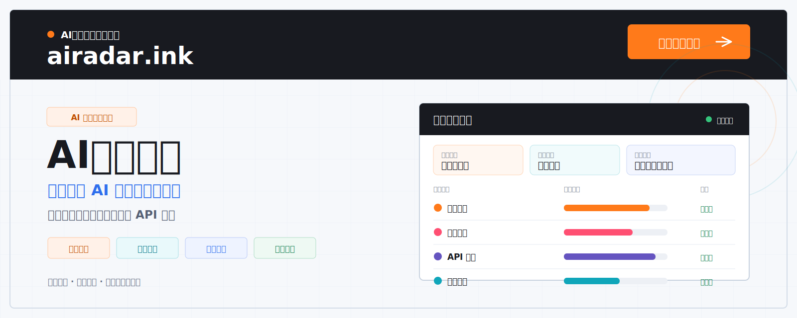
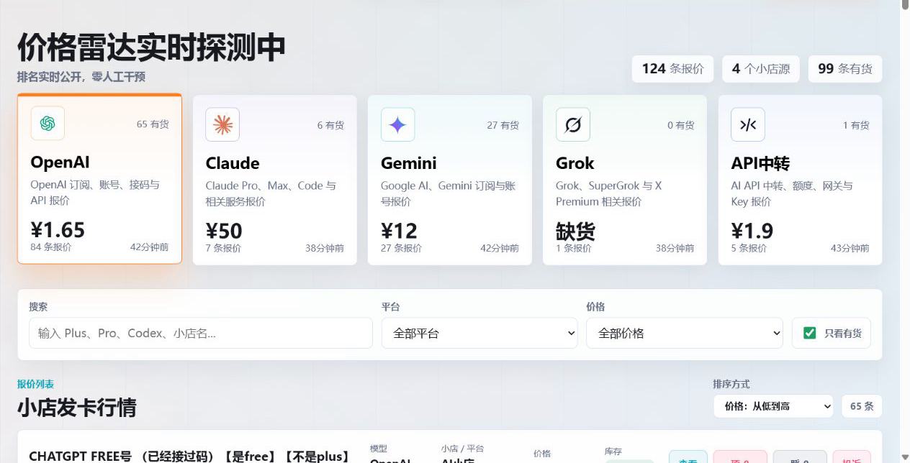

  

   

  **AI 模型、订阅套餐与 API 服务的报价聚合、比价与风险提示平台**  
  **A pricing discovery, comparison, and risk-awareness platform for AI products, subscriptions, and API services.**

   

  [**访问官网 / Visit Website**](https://airadar.ink) &nbsp;·&nbsp; [中文介绍](#中文介绍) &nbsp;·&nbsp; [English](#english)

---

## 中文介绍

### AI价格雷达是什么？

**AI价格雷达（AI Price Radar）** 是一个面向 AI 用户的信息聚合与价格比较平台。我们把分散在不同平台的 AI 模型、订阅套餐、账号服务和 API 报价整理到同一个页面，帮助用户快速了解：

- 同类产品目前有哪些报价；
- 不同报价来自哪个平台或小店；
- 当前价格、库存状态和最近更新时间；
- 其他用户对相关小店的反馈与投诉情况。

用户可以先在 AI价格雷达中完成搜索、筛选和比较，再前往原平台核验商品信息。平台不参与交易，也不替第三方商家提供购买担保。

### 主要功能

| 功能 | 说明 |
| --- | --- |
| 多品类聚合 | 集中展示 OpenAI、Claude、Gemini、Grok 与 API 中转等服务报价 |
| 快速搜索与筛选 | 按关键词、模型、平台、价格区间和库存状态查找报价 |
| 多维度比较 | 同时查看价格、库存、来源、更新时间与商品标签 |
| 用户反馈 | 通过用户评价辅助判断小店的实际体验与可信度 |
| 入驻与审核 | 支持小店提交入驻，审核通过后进入公开列表 |
| 投诉与下架 | 接收价格不实、缺货、链接失效等投诉，并按规则处理异常信息 |

### 收录范围

目前主要覆盖以下类别：

- **OpenAI**：ChatGPT、Codex、订阅、账号、接码与 API 相关服务；
- **Claude**：Claude Pro、Max、Code 与相关服务；
- **Gemini**：Google AI、Gemini 订阅与账号服务；
- **Grok**：Grok、SuperGrok 与 X Premium 相关服务；
- **API 服务**：AI API 中转、额度、网关与 Key 等服务。

### 信息流转

`公开报价与商家提交` → `分类整理与审核` → `搜索、筛选与排序` → `用户反馈与投诉` → `返回原平台核验`

### 立即访问

官网：[**https://airadar.ink**](https://airadar.ink)

  

---

## English

### What is AI Price Radar?

**AI Price Radar** is a pricing discovery and comparison platform for AI users. It brings scattered offers for AI models, subscriptions, account services, and APIs into one place, so users can quickly understand:

- what offers are currently available for the same category;
- which platform or store each offer comes from;
- the listed price, stock status, and latest update time;
- user feedback and complaint signals associated with each store.

Users can search, filter, and compare offers on AI Price Radar before visiting the original platform to verify the final product details. AI Price Radar does not sell these products, participate in transactions, or guarantee third-party sellers.

### Core capabilities

| Capability | What it provides |
| --- | --- |
| Multi-category aggregation | Offers across OpenAI, Claude, Gemini, Grok, and API services |
| Search and filtering | Find offers by keyword, model, platform, price range, and stock status |
| Side-by-side signals | Compare price, availability, source, update time, and product tags |
| Community feedback | Use public feedback as an additional reference when evaluating stores |
| Store submissions | Allow stores to submit listings for review before publication |
| Complaints and moderation | Report inaccurate prices, unavailable stock, or broken links for review |

### Coverage

- **OpenAI**: ChatGPT, Codex, subscriptions, accounts, phone verification, and API-related services;
- **Claude**: Claude Pro, Max, Code, and related services;
- **Gemini**: Google AI and Gemini subscription or account offers;
- **Grok**: Grok, SuperGrok, and X Premium-related services;
- **API services**: AI API relays, credits, gateways, and keys.

### Visit the website

[**https://airadar.ink**](https://airadar.ink)

---

## 仓库说明 / Repository Notice

本仓库目前仅用于 **AI价格雷达** 的项目介绍与公开信息发布，暂不提供源代码、安装包或部署文档。

This repository currently serves as the public project profile for **AI Price Radar**. Source code, installation packages, and deployment documentation are not published here at this time.

## 免责声明 / Disclaimer

AI价格雷达展示的信息来自公开网络、商家提交及用户反馈，仅供查询和比较，不构成购买建议。价格、库存和服务内容可能随时变化，请在交易前前往原平台核实，并自行判断交易风险。

Information displayed by AI Price Radar is collected from public sources, store submissions, and user feedback for discovery and comparison purposes only. Prices, availability, and service terms may change at any time. Always verify the final details on the original platform and assess transaction risks independently.
